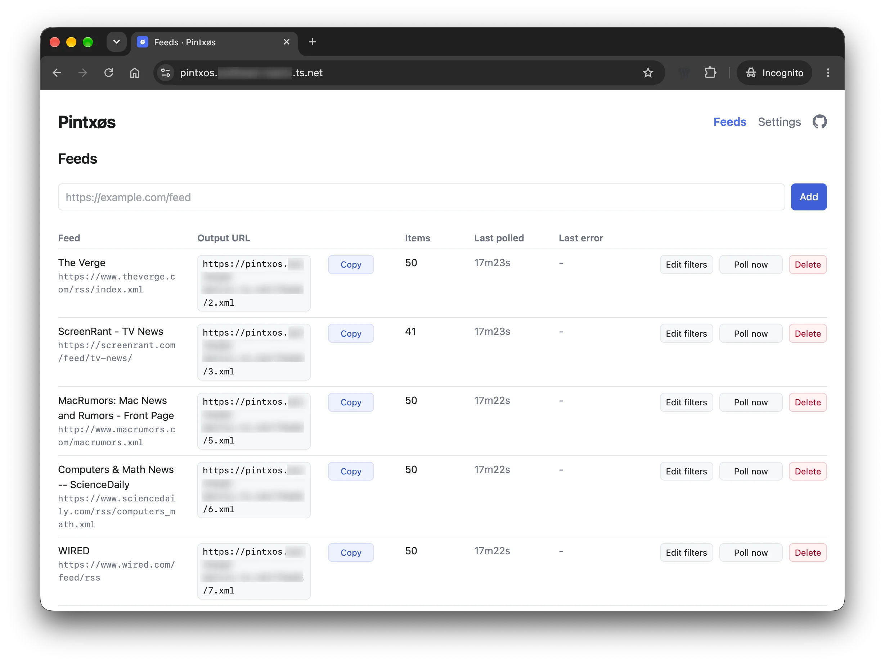

# Pintxøs – Bite-sized, honest RSS feeds.

[](https://github.com/janw76/pintxos/actions/workflows/docker.yml) [](LICENSE) [](https://github.com/janw76/pintxos/pkgs/container/pintxos)

**Garbage in, sanity out.**

Pintxøs grabs an RSS feed and republishes its articles as a new feed with neutral headlines and factual, ≤100-word summaries. No more clickbait or ragebait. Just plain facts.

## What / why

Article titles around the web are increasingly written just to be clicked, not read. Some egregious examples:

- "*Popular Open-World Franchise Quietly Confirms Huge Upgrade After Years of Waiting*". Which tool? What is the upgrade?
- "*Major Premier League Star Subject to ‘Unbelievable’ Bid as Huge Transfer Formally Agreed*". Who? Which teams? 
- "*Netflix's Renewed Sci-Fi Thriller With Perfect Rotten Tomatoes Score Officially Hits A Filming Milestone*". Which show? What milestone? 

Argh! 🤯

Pintxøs takes the original RSS feed, ingests the title and contents, and spits out a new RSS feed with a plain, useful title, a max. 100 word summary, and a link to the original post. 

Example:

- Original headline: "*Netflix's Renewed Sci-Fi Thriller With Perfect Rotten Tomatoes Score Officially Hits A Filming Milestone*"
- Pintxøs' rewritten headline: *"Netflix's Supacell completes season 2
  filming"*

Same story, no guessing games. Sanity restored. Point Pintxøs at a feed once, and every new item gets the same treatment automatically.



### Additional features

- **Ad filtering.** Skip deal posts, coupons and sponsored entries before they reach your feed. Built-in rules cover the usual "60% off" and promo-code posts. The feed's Edit page shows what the last poll dropped and why.
- **Keyword filtering.** Block or keep entries by title, globally or per feed, e.g. drop everything mentioning `cricket` or `horoscope`. Supports regular expressions.
- **Full text inline.** The whole article is appended below the summary, so you can read it in your feed reader without opening the site.
- **English summaries of foreign-language feeds.** By default headlines and summaries stay in the article's language. Turn that off, globally or per feed, to always get English.
- **Paywalled sites.** Paste your browser's cookies for sites you subscribe to and Pintxøs reads the full article instead of the teaser. Each feed shows whether the login worked.
- **Word count and reading time** on every item, so you know what you are clicking into.
- **Topic mute.** Per feed, turn on "Classify topics" on the feed's Edit page; one small AI call per new item classifies it into one of the 17 IPTC Media Topics top-level topics (arts, sport, weather, ...); tick topics to mute; muted items never reach the output feed and cost no summary call; percentages next to each topic show the share of classified items so far; keyword patterns are free and should be tried first; the "Filtered at last poll" list has a Summarize button per row to release an item.
- **Volume warning and daily budget.** A feed that suddenly produces far more summaries than usual gets a warning article at the top of its output feed, once per day; a per-feed "Max summaries per day" budget skips the rest before any fetch or summary call, with a Summarize button to release a skipped entry anyway.

## How it works

1. Poll each subscribed feed on a schedule.
2. Optionally skip entries that look like ads or coupon posts before doing
   anything else — see [Filtering ads, coupons and other
   noise](#filtering-ads-coupons-and-other-noise) below.
3. For each new item, fetch the article's own URL and extract the body text
   with [trafilatura](https://github.com/adbar/trafilatura).
4. If the page can't be fetched or extraction comes back too thin, fall back
   to the feed entry's own content (or, as a last resort, its title) — a
   `fallback` flag is kept on the item so you know which path was used.
5. Send the text to Claude to produce a factual headline and a short summary.
   This happens **once per item**, ever — the result is stored, and items are
   never re-summarized.
6. Serve the result back out as a clean RSS 2.0 feed, one output feed per
   subscribed input feed.

## Filtering ads, coupons and other noise

The ad filter is off by default; turn it on with `PINTXOS_FILTER_ADS=1` or the
checkbox on the Settings page. When enabled, it skips entries that look like
ads or coupon posts before fetching or summarizing them, so they cost
nothing and never reach the output feed — detected by RSS category (e.g.
Wired's "Gear / Deals" tag), title shape ("Groupon Promo Codes: 60% Off in
September 2026"), or a URL slug ending in `-promo-code`/`-coupons`. The
built-in rules also cover Tom's Guide style sale posts ("Labor Day sale",
"save up to 50%", "44% off"). You can
add your own regexes, one per line, via `PINTXOS_AD_TITLE_PATTERNS` or the
same Settings textarea. Titles matching `PINTXOS_AD_KEEP_PATTERNS` (also one
regex per line, editable on the Settings page) are never filtered, overriding
every block rule including the built-ins. Built-in keep rules already rescue
obvious news headlines (stock sale, for sale, lawsuits, fraud) from the block
rules above; `PINTXOS_AD_KEEP_PATTERNS` adds to them. The filter only applies to entries
seen after it is turned on — it never touches items already stored. The Feeds page shows "N
filtered" under a feed's item count for its last poll. Each feed can also
override the global switch and choose whether it inherits, extends, or
ignores the global patterns from its Edit page. The feed's Edit page also
lets you override its title; leave the field blank to fall back to the
feed's own title.

```
black friday
\bgiveaway\b
^sponsored:
```

The filter was contributed by Eric Bowman (@ebowman) — see
[pintxos#2](https://github.com/janw76/pintxos/pull/2).

### Topic mute

The ad filter is free and catches deal posts; topic mute is for muting whole
subjects (sport, weather, arts, ...) that you never want in your feed, at
the cost of one small AI call per new item. It's off by default, per feed:
turn on "Classify topics" on the feed's Edit page and each new item is
classified into one of the 17 IPTC Media Topics top-level topics, then
matched against the topics you've ticked to mute.

- Tick any of the 17 topics to mute it; a muted item is dropped before
  summarizing, so it costs nothing and never reaches the output feed.
- Each topic shows a running percentage — the share of classified items so
  far that fell into it — shown once at least one item fell into that topic.
- Keyword title patterns (above) are free and run first; reach for topic
  mute only for what they can't catch.
- The "Filtered at last poll" list shows every item dropped by either
  mechanism and why. Ad-filtered and muted-topic rows carry a Summarize
  button to release that one item into the output feed anyway.

IPTC Media Topics vocabulary © IPTC (https://iptc.org/), used under CC BY 4.0.

### Volume warning and daily budget

A feed that starts producing an unusual number of summaries in a day is
worth a second look — it may be an oversized feed, a misconfigured URL, or
just a very busy news day. Once a feed reaches 50 summaries on a given day,
Pintxøs prepends a warning article to that feed's output — a stronger one at
100 — that explains what happened and links straight to the feed's Edit
page. Each level fires once per day; the warning never touches the feed's
own items.

- The warning is per feed, On by default; flip it Off in the "Volume"
  fieldset on the feed's Edit page if you'd rather not see it.
- "Max summaries per day" sets a hard budget for the feed, blank for
  unlimited; once the budget is reached, further entries are skipped before
  any fetch or summary call, so they cost nothing.
- Skipped entries show up in the "Filtered at last poll" list like any other
  filtered item, with a Summarize button to release one anyway.
- The feed's Edit page always shows "Summaries: N today, M total" so you can
  see where a feed stands against its budget.

## Quickstart

```yaml
services:
  pintxos:
    image: ghcr.io/janw76/pintxos:latest
    container_name: pintxos
    ports:
      - "8000:8000"
    volumes:
      - ./data:/data
    environment:
      ANTHROPIC_API_KEY: ${ANTHROPIC_API_KEY}
      # OPENROUTER_API_KEY: ${OPENROUTER_API_KEY}  # only needed for models with a slash
      # PINTXOS_MODEL: claude-haiku-4-5-20251001
      # PINTXOS_POLL_MINUTES: 30
      # PINTXOS_ITEMS_PER_FEED: 50
      # PINTXOS_BASE_URL: https://pintxos.example.com
    restart: unless-stopped
```

Put your key in a `.env` file next to `docker-compose.yml` (see
`.env.example`), then:

```bash
docker compose up -d
```

Open `http://localhost:8000`, add a feed URL, and copy the generated output
feed URL into your RSS reader of choice. My favorite is [NetNewsWire](https://netnewswire.com).
The box above the table filters your feeds by title or URL as you type, and the Add
button activates once you paste in a feed URL.

If you run [Tailscale](https://tailscale.com), I would recommend to expose Pintxøs [as a service](https://tailscale.com/docs/features/tailscale-services), which will give you a proper URL with https you can access easily from any RSS client in your Tailnet.

### Run without Docker

Pintxøs is a single Python process with a SQLite file, so it runs fine
without a container. You'll need Python 3.12 or newer.

Install it with [uv](https://docs.astral.sh/uv/):

```bash
uv tool install git+https://github.com/janw76/pintxos
pintxos
```

Or run it without installing anything permanently:

```bash
uvx --from git+https://github.com/janw76/pintxos pintxos
```

Or install it with pip:

```bash
python3 -m venv .venv && .venv/bin/pip install -e .
# or, without cloning the repo first:
python3 -m venv .venv && .venv/bin/pip install git+https://github.com/janw76/pintxos
```

Then run it:

```bash
.venv/bin/pintxos
# or: .venv/bin/python -m pintxos
```

Copy `.env.example` to `.env` in the directory you run `pintxos` from, and
fill in `ANTHROPIC_API_KEY` (and any other overrides), or export the
variables directly — real environment variables always win over `.env`. The
SQLite database lives in `./data` relative to that directory unless you set
`PINTXOS_DATA_DIR`, so run `pintxos` from a stable directory.

By default the server binds to `127.0.0.1:8000`, i.e. only this machine can
reach it. To reach it from other machines — for example your RSS reader on a
phone, over Tailscale — set `PINTXOS_HOST=0.0.0.0` or to your Tailscale IP,
or pass `--host`/`--port` on the command line. Before doing so, read the
[Security warning](#security-warning) section below.

To keep it running as a background service (systemd on Linux, launchd on
macOS), see [docs/deploy-native.md](docs/deploy-native.md).

## Configuration

Model, poll interval, items per feed and the API key can be set via environment
variable, or (if unset) via the Settings page in the web UI, which persists them
to the database. `PINTXOS_BASE_URL`, `PINTXOS_DATA_DIR`, `PINTXOS_HOST`,
`PINTXOS_PORT` and `PINTXOS_IMPERSONATE` are environment-only.

| Env var | Default | Meaning |
|---|---|---|
| `ANTHROPIC_API_KEY` | *(none)* | Anthropic API key. See note below. |
| `OPENROUTER_API_KEY` | *(none)* | OpenRouter API key. Needed only for models with a slash in the name. |
| `PINTXOS_MODEL` | `claude-haiku-4-5-20251001` | Default model. Names with a slash go to OpenRouter, names without go to Anthropic. Feeds can override it. |
| `PINTXOS_POLL_MINUTES` | `30` | How often feeds are polled, in minutes. |
| `PINTXOS_ITEMS_PER_FEED` | `50` | Items kept per output feed (older ones pruned). |
| `PINTXOS_FILTER_ADS` | `0` | Skip ad/coupon entries before fetch/summarize. Set to `1` to turn this on. |
| `PINTXOS_FULL_TEXT` | `1` | Append the extracted article text after each summary in the output feed, below the Original line. Set to `0` to turn this off. |
| `PINTXOS_RESPECT_LANGUAGE` | `1` | Write headline and summary in the article's language. Set to `0` to always summarize in English. Appended full text is never translated. Each feed can override this on its Edit page. |
| `PINTXOS_AD_TITLE_PATTERNS` | *(empty)* | Extra title regexes, one per line, matched case-insensitively, in addition to the built-in ad rules. |
| `PINTXOS_AD_KEEP_PATTERNS` | *(empty)* | Title regexes, one per line, matched case-insensitively; a match overrides every block rule, built-ins included, and the entry is kept. |
| `PINTXOS_BASE_URL` | *(none, inferred from the request)* | Base URL used to build output feed links, e.g. `https://pintxos.example.com`. |
| `PINTXOS_DATA_DIR` | `./data` | Directory for the SQLite database and `cookies.txt`. |
| `PINTXOS_HOST` | `127.0.0.1` | Host/interface the server binds to. The Docker image sets `PINTXOS_HOST=0.0.0.0`. |
| `PINTXOS_PORT` | `8000` | Port the server binds to. |
| `PINTXOS_IMPERSONATE` | `safari17_0` | curl_cffi browser TLS/HTTP fingerprint used for all fetches, so Cloudflare-fronted sites accept the request. Set empty to disable impersonation (uses the Pintxøs User-Agent instead). A comma-separated list is tried in turn when Cloudflare challenges a request, e.g. `safari17_0,safari17_2_ios`. |
| `PINTXOS_NO_SCHEDULER` | *(unset)* | Set to `1` to disable polling entirely, periodic **and** manual (Poll now queues forever). For tests and CI only. For a local run without periodic polls, set `PINTXOS_POLL_MINUTES=1440` instead. |

The ad filter toggle and extra patterns can also be changed on the Settings page unless the corresponding environment variable is set.

## Paywalled feeds

If a feed only carries a short teaser and the article itself is behind a
paywall, Pintxøs cannot read the full text. For sites you subscribe to,
you can give Pintxøs your own login: log in to the site in your browser,
then hand Pintxøs the login cookie. Each site's cookie is only ever sent
back to that same site.

1. Install the free, open-source [Cookie-Editor](https://cookie-editor.com)
   browser extension (Safari, Chrome, Firefox).
2. Open the website you want full articles from and log in.
3. Click the Cookie-Editor icon, choose **Export**, then **Netscape**. The
   cookies are now on your clipboard.
4. Paste them at the end of the box on the Settings page and click
   **Save**. Repeat for each site. You can also upload a cookies.txt file
   there, or copy it to `<PINTXOS_DATA_DIR>/cookies.txt` by hand.

Pintxøs uses the new cookies on the next poll. On a feed's page, "Retry
fallback items" re-reads articles that were stored as teasers. When the
Feeds page shows "login failed", log in again and repeat the steps
above: cookies expire.

Short pages that declare themselves free (schema.org `isAccessibleForFree`)
or are video/audio pages are summarized as they are and never reported as
paywalled.

Fetches impersonate a real browser (`PINTXOS_IMPERSONATE`, default
`safari17_0`), because these sites reject plain HTTP clients before ever
looking at a cookie. A challenged request is retried on the next
profile in the list, requests to one site are spaced two seconds
apart, and each scheduled poll re-fetches up to three items that were
blocked earlier.

## Security warning

**Pintxøs has no authentication.** Anyone who can reach the web UI can add,
delete, or repoll feeds, and anyone who can reach an output feed URL can read
it — this is by design, so RSS readers can fetch feeds without credentials.
Only run Pintxøs on `localhost`, over Tailscale/a VPN, or behind a reverse
proxy that handles authentication for you. **Do not expose it directly to the
public internet**. If you use the paywalled-feeds feature above, the cookies
file is equivalent to being logged in to those sites and is stored
unencrypted in the data directory, so keep it on a private machine and
remove it from Settings once you stop using it; it's meant for reading with
your own account, so check the publisher's terms.

## API key

The primary way to configure `ANTHROPIC_API_KEY` is the environment variable
(shown in the Quickstart above). If — and only if — the environment variable
is not set, the Settings page lets you store a key in the database instead.

## Cost

Pintxøs uses Claude Haiku and makes exactly one API call per new article,
never more: items are summarized once and stored, and are never
re-summarized on subsequent polls. Feeds with "Classify topics" turned on
add one more small call per new item — the topic classification call is
roughly 15% of the cost of a summary call, and only runs on feeds with the
switch on. A per-feed "Max summaries per day" budget caps the number of
summary calls that feed can make in a day, regardless of how much it polls.

## Choosing a model

A model name with a slash (e.g. `google/gemini-2.5-flash-lite`) is sent to OpenRouter using `OPENROUTER_API_KEY`; a name without a slash (e.g. `claude-haiku-4-5-20251001`) is sent to Anthropic using `ANTHROPIC_API_KEY`. Both providers bill per token through API keys — a ChatGPT or Claude chat subscription cannot be used.

| Model | Cost per 100 articles | Notes |
|---|---|---|
| `claude-haiku-4-5-20251001` | ~$0.28 | Anthropic direct. Current default, strongest multilingual output. |
| `anthropic/claude-haiku-4.5` | ~$0.28 | Same model via OpenRouter. |
| `openai/gpt-5-mini` | ~$0.08 | Same quality tier as Haiku at a third of the price. |
| `google/gemini-2.5-flash-lite` | ~$0.03 | Recommended starting point. Fast, reliable JSON, good in European languages. |

Prices are OpenRouter's as of September 2026 and drift; see the full list at [openrouter.ai/models](https://openrouter.ai/models). The same four presets are clickable on the Settings page.

Each feed can override the model on its Edit page — a premium model for one feed, the cheapest for another; leaving it blank uses the global default.

Save the model on the Settings page first, then click "Test saved model" to run a tiny completion with it and the saved key — it shows the model's answer or the exact error.

Cheaper models may fail the required JSON output format more often; those items are logged as summarize errors and retried on the next poll.

Even though Haiku is the cheapest model Anthropic offers today and Pintxøs avoids repolling and processing, I still recommend watching cost — on [Claude Console](https://platform.claude.com/) for Anthropic models, and on [OpenRouter's activity page](https://openrouter.ai/activity) for models with a slash. Cost will obviously scale with the number feeds you poll and the amount of articles published per feed.

## Usage

1. Open the web UI and add a feed URL.
2. Wait for the next poll (or click "poll now").
3. Copy the feed's output URL — pattern `/feeds/<id>.xml` — into your RSS
   reader.

## Development

```bash
python -m venv .venv && .venv/bin/pip install -e .[dev]
.venv/bin/pytest
.venv/bin/pintxos  # or: python -m pintxos
docker build -t pintxos .
```

## Other tools

See also  [docs/prior-art.md](docs/prior-art.md) for a full survey. Many of these do amazing things but I wanted something simple that does 1-2 things I want and need very well, nothing else. 

- The closest existing match seems to be [RSSbrew](https://github.com/yinan-c/RSSbrew) (Docker, web UI, persisted store, real republished feed), but it never fetches the original article page and prepends a summary rather than rewriting the
headline.
- Radar RSS: Real-time intelligent dynamic RSS news aggregator with Google Gemini AI curation, Windows desktop application, and native Android app support.
- ...


## License

MIT — see [LICENSE](LICENSE).
